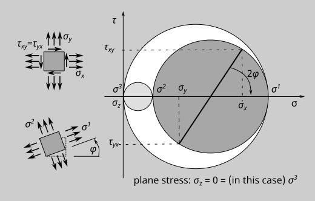
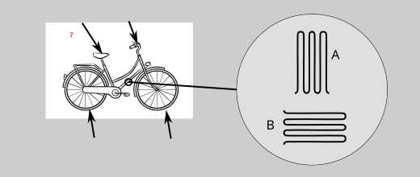
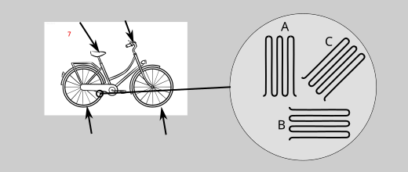

# repetition / basic knowledge

## generalized HOOKE's law

The "generalized HOOKE's law" is an [isotropic](https://en.wikipedia.org/wiki/Isotropy) linear-elastic material model for 3D continuum or with loads in any direction (see "Derivation of Hooke's law in three dimensions" in [Linear elasticity theory for continuous media](https://en.wikipedia.org/wiki/Hooke's_law#Isotropic_materials).

The law is typically derived (like in the previous link) "inductive", which means drawing conclusions "from the particular to the general". The opposite is "deductive, which means drawing conclusions "from the general to the particular".

For linear-elastic and isotropic materials the Law is written like:

$E\,\epsilon_x=\sigma_x-\nu\,(\sigma_y+\sigma_z)$  
$E\,\epsilon_y=\sigma_x-\nu\,(\sigma_x+\sigma_z)$  
$E\,\epsilon_z=\sigma_x-\nu\,(\sigma_x+\sigma_y)$  

$G\,\gamma_xy=\tau_{xy}$  
$G\,\gamma_xz=\tau_{xz}$  
$G\,\gamma_yz=\tau_{yz}$  

with:  
$E$: young's modulus (elastic modulus)  
$\nu$: poisson ratio  
$ \sigma_{...}$, $\tau_{...}$: normal and shear stress  
$ \epsilon_{...}$, $\gamma_{...}$: elongation and shearing (strains)  

Since the linear-elastic material behavior (for small strains and isotropic material) is described with two elastic constants, there must be a relationship between the three elastic constants mentioned above:

$G=\frac{E}{2\,(1+\nu)}$

## MOHR's circle

The three dimensional stress state can be shown using [MOHR's circle](https://en.wikipedia.org/wiki/Mohr's_circle). 

As each circle always has two points of intersection with the horizontal stress axis (where the shear stress is zero), there is a special coordinate system (the principal system) in which the current stress state is only described by 3 normal stresses, the so-called **principal stresses $\sigma^{(1)}$, $\sigma^{(2)}$, $\sigma^{(3)}$**.

## example: strain gauge measurement analysis

### 1
As a result of a [strain gauge measurement](https://en.wikipedia.org/wiki/Strain_gauge) at one point on a surface of a bicycle frame the followng strains are measured:  
$\epsilon_A=1,0\cdot10^{-3}$  
$\epsilon_B=0,5\cdot10^{-3}$  

The Material is homogenous and isotropic with an YOUNGth modulus of aprox. $E=200 \text{GPa}$ and a POISSON ratio of $\nu=0,2$.  
**Calculate the stresses! in the directoin of the strain gauges**  

### 2
To get the full plain stress state (in another point), three strain gauges are applied. The measured strains are:  

$\epsilon_A=5,8\cdot10^{-4}$  
$\epsilon_B=-0,2\cdot10^{-4}$  
$\epsilon_C=4,3\cdot10^{-4}$  

The Material is homogenous and isotropic with an YOUNGs modulus of  aprox. $E=200 \text{GPa}$ and a POISSON ratio of $\nu=0,2$.
**Calculate the stresses (normal and shear stresses) according to the strain gauge directions A/B, and the principal stresses/ max shear stress!**  

You can find an example in [this video](https://youtu.be/7ul8ST6RRUA?si=y-b_LYSKZI4dZjJc)
