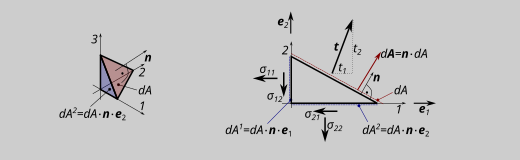

# stress tensor, traction

## stress in one dimension, engineering stress definition

The mechanical stress is defined as a force related to the surface $\sigma=F/A$ (or a small part of a force $dF$ related to a small part of the surface $dA$). 
Two types of stress can thus be defined: the real stress (which refer to the real actual geometry $dA$) and the technical stress (which refers to the initial or referenz geometry $dA_0$).  
For small deformations (or strains; and this is what we are looking at here), the engineering stress is almost equal to the real stress. 

engineering stress: $\sigma=F/A\approx F/A_0; \;\; \sigma= dF/dA\approx F/dA_0$

## stress tensor

The following explanations are written down for 2-dimensional problems (plane stress state). All statements can be transferred analogously to 3 dimensions.

In the figure, $\vec{t}=\boldsymbol{t}=t_{i}$ is the traction vector. The total stress state at one point is described by two (or in 3D three) traction vector for two (or in 3D three) perpendicular cuttting planes. The traction vectors occurring on each section plane can be written in components with respect to an orthonormal basis resulting from the normal vectors on each section plane. The components of each vector can be written in the rows of a tensor 2. grade: the stress tensor $\boldsymbol{\sigma}=\sigma_{ik}$:

$\vec{t}^1=\boldsymbol{t}^1=t_{i}^1=
\sigma^1 \cdot \boldsymbol{e}^1+\tau^1 \cdot \boldsymbol{e}^2=
\sigma^{11} \cdot \boldsymbol{e}^1+\sigma{21} \cdot \boldsymbol{e}^2$  
$\vec{t}^2=\boldsymbol{t}^2=t_{i}^2=
\tau^2 \cdot \boldsymbol{e}^1+\sigma^2 \cdot \boldsymbol{e}^2=
\sigma^{21} \cdot \boldsymbol{e}^1+\sigma{22} \cdot \boldsymbol{e}^2$

stress tensor:
$\boldsymbol{\sigma}=\sigma_{ik}=
\begin{bmatrix}
\sigma^{11} & \sigma^{12} & (\sigma^{13})\\
\sigma^{21} & \sigma^{22} & (\sigma^{23})\\
(\sigma^{31}) & (\sigma^{31}) & (\sigma^{33})\\
\end{bmatrix}$

---
**NOTE**

Due to the moment equilibrium, the assigned shear stresses must be equal.  
The following therefore applies $\sigma_{ik}=\sigma_{ki}$ The stress tensor is symmetric!

---

*EXAMPLE*

A: Write down the stress tensor for the given stresses!  
B: Calculate the traction $\boldsymbol{t}$ (components in the $1$-$2$-system)  
C: Calculate the traction $\hat{\boldsymbol{t}}$ (components in the $\hat{1}$-$\hat{2}$-system)  

## cauchy formula

Another way to calculate the traction: If a small surface or volume elemnet is cut under a certian direction, the cutting surface is $dA$ and the direction of the cutting plane is given by its normal vector $\boldsymbol{n}$. The projection of the Surface $dA$ on each plane of the basis system ($1$-$2$-plane, $2$-$3$-plane, $1$-$3$-plane) results by the scalar product of the oriented surface vector $dA \cdot \boldsymbol{n}$ with the base-vector perpendicular on this plane (for ex.: $1$-$2$-plane $A^{12}= (dA \cdot \boldsymbol{n})\cdot \boldsymbol{e}_1$. The equilibrium in $1$-direction of a small cuttex volume element is:  

$\rightarrow \text{ : }0=t_1\cdot dA-
\sigma_{11}(dA \cdot \boldsymbol{n})\cdot \boldsymbol{e}_1)-
\sigma_{21}(dA \cdot \boldsymbol{n})\cdot \boldsymbol{e}_2)-
\sigma_{31}(dA \cdot \boldsymbol{n})\cdot \boldsymbol{e}_3)$

$\boldsymbol{n} \cdot \boldsymbol{e}_1 = (n_1 \cdot \boldsymbol{e}_1+n_2 \cdot \boldsymbol{e}_2+n_3 \cdot \boldsymbol{e}_3) \boldsymbol{e}_1$

for a orthonomal basis $\boldsymbol{e}_i \cdot \boldsymbol{e}_k =1 \text{ for }i=k; =0 \text{ for }i\neq k$

$\Rightarrow$  
$0=t_1-\sigma_{11}\;n_1-\sigma_{21}\;n_2-\sigma_{31}\;n_3$  
$0=t_2-\sigma_{12}\;n_1-\sigma_{22}\;n_2-\sigma_{32}\;n_3$  
$0=t_3-\sigma_{13}\;n_1-\sigma_{23}\;n_2-\sigma_{33}\;n_3$  

$\Rightarrow\;t_k=\sigma_{ik}\;n_i=\boldsymbol{t}=\boldsymbol{\sigma^T}\cdot \boldsymbol{n}$ 

*EXAMPLE*

Calculate $\boldsymbol{t}$ in the ex. above with the CAUCHY-formula

## principal stresses and invariants

work in progress

[see the hand written script](https://campuas.frankfurt-university.de/pluginfile.php/459922/mod_folder/content/0/SS23_LMMD_skrip.pdf?forcedownload=1)

