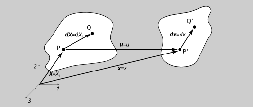

# deformatoin / infinitesimal strain tensor

## strain definition in one dimension

In a one dimensional system the deformation of a infinitesimal line-element (endpoints $P$ and $Q$) is defined by the quantities:  
- $X$, the material coordinate(s) (reference configuration; "names" of each material point  
- $u(X,t)$, the displacement/relative movement of each point "named" $X$
- $x(u,t)=x(X,t)$, the current coordinate(s) of each point (current configuration)  
- $dX$, "undeformed" distance between $P$ and $Q$ 
- $dx$, "deformed" distance between the points at the new location $P'$ and $Q'$

The new locatoin of the material poins is decribed by:  
$P'=x_P=x(X_P,t)=X(P)+u(P,t)$ and  
$Q'=x_Q=x(X_Q,t)=X(Q)+u(Q,t)=x(P,t)+dx(t)=X(P)+dX+u(P,t)+du(t)$  

By the way, the time $t$ only indicates, that there are different deformatoins possible. The time here is more a loadstep or load scale factor than a real time.

The new length $dx$ of the line-element $dX$ is:  
$dx=x(Q,t)-x(P,t)=[X(P)+dX+u(P,t)+du(t)]-[X(P)+u(P,t)]=dX+du$  
and the relative change or the deformation gradiet $F$ of the line element is  
$F=dx/dX=dX/dX+du/dX=1+du/dX$  
$F=dx/dX=\lambda$ is the stretch (not the strain; the reason for all this different variables will be clear after the next chapter). For a undeformed structure $\lambda=1$ (not $0$). A strain like deformation-quantity is  

$G=1/2(F^2-1)=1/2[(1+du/dX)^2-1]=1/2[(1+2\cdot du/dX+d^2u/dX^2)-1]$
$=du/dX+1/2 \cdot d^2u/dX^2 $ 

For small strains (small deformatoins) the line-element $dx$ is nearly unchanged and $du/dX\approx du/dx$ and $d^2u/dX^2\approx 0$. So the engineering strain $\epsilon$ is defined by:  
$G\approx \epsilon=du/dx=\lambda-1$

---
**Example**

The deformation of a truss (Endpoints $X(P)=11$; $X(Q)=1$) is given by the following equation:
$x=1/4\,(5\cdot X+19)$  

* draw a sketch of the undeformend end deformed truss
* calculate the displacement $u$
* calculate the strain $\epsilon$
* calculate the stretch $\lambda$ (here equal to $F$, because of  one dim.)

---

## three dim. deformation / deformation gradient

For three dimensions, it is nearly the same, but a little bit more complicated.  
The vectors $\boldsymbol{X}=X_i$ are the material coordinates (the "nemes" of each point)  
The vectors $\boldsymbol{x}(X)=x_i$ are the current coordinate(s) of each point and describe the deformed geometry.  
The vectors $\boldsymbol{u}(X)=\boldsymbol{x}-\boldsymbol{X}=u_i$ are the displacement of each point.  

The displacement is a vector field can change in every point. The variiation of $\boldsymbol{u}$ is decibed by the total derivate of eachvector componend:  
$du_i=\frac{\partial u_i}{\partial X_j}dX_j=\left(\begin{array}
{c} \frac{\partial u_1}{\partial X_1}dX_1+\frac{\partial u_1}{\partial X_2}dX_2+\frac{\partial u_1}{\partial X_3}dX_3 \\
 \frac{\partial u_1}{\partial X_1}dX_1+\frac{\partial u_1}{\partial X_2}dX_2+\frac{\partial u_1}{\partial X_3}dX_3 \\ 
 \frac{\partial u_1}{\partial X_1}dX_1+\frac{\partial u_1}{\partial X_2}dX_2+\frac{\partial u_1}{\partial X_3}dX_3  \end{array}\right)$  
 
or

$du_i=\frac{\partial u_i}{\partial X_j}dX_j=
\frac{\partial (x_i-X_i)}{\partial X_j}dX_j=
\frac{\partial x_i-\partial X_i}{\partial X_j}dX_j=$  
$\frac{\partial x_i}{\partial X_j}dX_j-\frac{\partial X_i}{\partial X_j}dX_j=
\frac{\partial x_i}{\partial X_j}dX_j-\delta_{ij}\,dX_j=
\frac{\partial x_i}{\partial X_j}dX_j-dX_i$

$d\boldsymbol{u}=d\boldsymbol{x}-d\boldsymbol{X}=\frac{\partial \boldsymbol{x}}{\partial \boldsymbol{X}}d\boldsymbol{X}-d\boldsymbol{X}=\frac{\partial x_i}{\partial X_j}dX_j-dX_i$

so, the change of the infinitesimal line element $\boldsymbol{dX}$ to $\boldsymbol{dx}$ is described by [deformation gradient $\boldsymbol{F}$](https://www.continuummechanics.org/deformationgradient.html):  

$\boldsymbol{F}={\partial \boldsymbol{x}}/{\partial \boldsymbol{X}}=F_{ij}={\partial x_i}/{\partial X_j}$

The tensor $\boldsymbol{F}$ decribes the stretch of the line elemnet $d\boldsymbol{X}$. For an undeformed body $\boldsymbol{X}=\boldsymbol{x}$ and $\boldsymbol{F}=\boldsymbol{1}=F_{ik}=\delta_{ik}$.  
For a constant displacemant $x_i=X_i+k$ $F_{ik}=\delta_{ik}$ too.  
For a rigid body rotation, the line element $\boldsymbol{X}$ only changes the orientation, but not the length. But the componets of $\boldsymbol{X}$ are changing, and so $F_{ik}\neq \delta_{ik}$. This is a problem, because so $\boldsymbol{F}$ does not easyly indecates a deformation of the body  
The rotation in $\boldsymbol{F}$ can be elininated by using the fact, that for a pur rotation tensor it is:  

$\boldsymbol{R}\cdot\boldsymbol{R}^T=\boldsymbol{1}$ or $R_{ik}\cdot R_{jk}=\delta_{ij}$

The deformationgradient F can be splitted in a pure rotation R and a Deformatoin U or V (depending on the order of the two operations).

---
**Example**

The movement of a body is described by the vector-function

A: $x^A_i(t)=\left(\begin{array}
{c}X_1+2t \\
X_2+t \\ 
X_3\\
\end{array}\right)$

B: $x^B_i(t)=\left(\begin{array}
{c}X_1-X_2\cdot cos(t)\\
X_2-X_1\cdot sin(t) \\ 
X_3\\
\end{array}\right)$

a: Sketch the resulting deformation for a simple body
b: Calculate the deformation gradient $\boldsymbol{F}$
c: Calculate $\boldsymbol{F}^T\cdot $\boldsymbol{F}$

---

## strain tensor (finite strain theorie)

So, one can do the following operation: 
$\boldsymbol{F}=\boldsymbol{R}\cdot\boldsymbol{U}=\boldsymbol{V}\cdot\boldsymbol{R}$=$F_{ik}=R_{in}\cdot U_{nk}=V_{im}\cdot R_{mk}$

and: 
$\boldsymbol{F}^T\cdot \boldsymbol{F}=F_{op}\cdot F_{oq}=$
$(R_{on}\cdot U_{np})\cdot (R_{om}\cdot U_{mq})=$
$R_{on}\cdot R_{om}\,\,\cdot\,\, U_{np} \cdot U_{mq} =$
$\delta_{nm}\cdot\,\, U_{np} \cdot U_{mq} =$
$U_{mp} \cdot U_{mq}=C_{pq}$

After this operation a tensor $\boldsymbol{C}$ is created, in which the rigit body rotation is eleminated. This deformation tensor is called:

**CAUCHY-GREEN-deformation tensor**: $\boldsymbol{C}=\boldsymbol{U}^T \cdot \boldsymbol{U}$ or $C_{pq}=U_{mp} \cdot U_{mq}$

For an undeformed body $\boldsymbol{C}=\boldsymbol{1}$. A deformation tensor which is $\boldsymbol{0}$ is the

**GREEN-LAGRANGE-deformation tensor**: $\boldsymbol{G}=1/2(\boldsymbol{C}-\boldsymbol{1})$ or $G_{pq}=1/2(C_{pq} - \delta_{pq})$

The formulation of these equations is generally valid, i.e. for large deformatins ([Finite-Strain-Theorie](https://en.wikipedia.org/wiki/Finite_strain_theory)). 

## infinitesimal strain tensor (linear theorie)

To get a linear deformatoin tensor the tensor $\boldsymbol{G} must first be reformulated:

The deformation gradient can be written as a function of the displacement $\boldsymbol{u}$:

$F_{ki}=\frac{\partial x_k}{\partial X_i}=\frac{\partial (X_k+u_k)}{\partial X_i}$
$=\frac{\partial X_k+\partial u_k}{\partial X_i}=\frac{\partial X_k}{\partial X_i}+\frac{\partial u_k}{\partial X_i}$
$=\delta_{ki}+\frac{\partial u_k}{\partial X_i}$

so: 

$F_{ki}\cdot F_{kj}=(\delta_{ki}+\frac{\partial u_k}{\partial X_i})\cdot(\delta_{kj}+\frac{\partial u_k}{\partial X_j})$
$=\delta_{ki}\delta_{kj}+\frac{\partial u_k}{\partial X_i}\delta_{kj}+\delta_{ki}\frac{\partial u_k}{\partial X_j}+\frac{\partial u_k}{\partial X_i}\frac{\partial u_k}{\partial X_j}$
$=\delta_{ij}+\frac{\partial u_j}{\partial X_i}+\frac{\partial u_i}{\partial X_j}+\frac{\partial u_k}{\partial X_i}\frac{\partial u_k}{\partial X_j}$

For small deformations the following is approximately 

$\partial X_i\approx \partial x_i$ and $\frac{\partial u_k}{\partial X_i}\frac{\partial u_k}{\partial X_j}\approx 0$

so the **infinitesimal strain tensor** $\boldsymbol{\epsilon}$ is

$G_{ij}\approx \frac{1}{2}(\frac{\partial u_i}{x_j}+\frac{u_j}{x_i})=\epsilon_{ij}$

Interpretatino of $\boldsymbol{\epsilon}$:

$\epsilon_{11}=\frac{\partial u_1}{\partial x_1}$: classical normal strain

$\epsilon_{12}=\epsilon_{21}=\frac{1}{2}(\frac{\partial u_1}{x_2}+\frac{u_2}{x_1})=\frac{1}{2}\gamma_{12}$: half of the classical shear strain

$\boldsymbol{\epsilon}=\epsilon_{ik}=
\begin{bmatrix}
\epsilon_{11} & \epsilon_{12} & \epsilon_{13}\\
\epsilon_{21} & \epsilon_{22} & \epsilon_{23}\\
\epsilon_{31} & \epsilon_{31} & \epsilon_{33}\\
\end{bmatrix} =
\begin{bmatrix}
\epsilon_{11} & \frac{1}{2}\gamma_{12} & \frac{1}{2}\gamma_{13}\\
\frac{1}{2}\gamma_{21} & \epsilon_{22} & \frac{1}{2}\gamma_{23}\\
\frac{1}{2}\gamma_{31} & \frac{1}{2}\gamma_{32} & \epsilon_{33}\\
\end{bmatrix}$

---
**Example**

The movement of a body is described by the vector-function

$x_i(t)=\left(\begin{array}
{c}X_1 \\
X_2-t\cdot X_3\\
X_3+t\cdot X_2\\ 
\end{array}\right)$

a: Sketch the resulting deformation for a simple body and $t=0,5$
b: Calculate $\boldsymbol{F}$,  $\boldsymbol{F}$ and  $\boldsymbol{\epsilon}$

---
