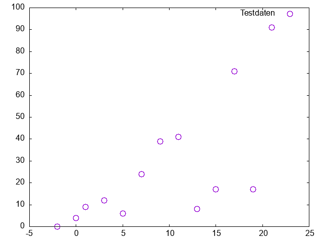

# Gnuplot Basics

## Introduction 

Script-based programming languages like [python](https://www.python.org/) or [R](https://www.r-project.org/) are recommended for analysing large volumes of data. Compared to ‘proper’ programming languages, these have the advantage that their command sets are relatively easy to implement. Although such scripts are initially more difficult to understand than programmes such as EXCEL, they enable more efficient work when dealing with complex applications, numerous repetitions or simply very large volumes of data.

Here, [Gnuplot](https://en.wikipedia.org/wiki/Gnuplot) is used. Compared to Python or R, Gnuplot is very limited and focuses primarily on the graphical representation of datasets. However, it has the same scripting command character, is easy to install on all platforms, and offers a manageable set of commands.

## First small Gnuplot script

Gnuplot can display the output directly on the screen or save it directly to a file in a variety of graphic formats. Therefore, the output need to be specified in the first line. Here, the “Windows terminal” (standard on Windows computers) is set. The second and third line begins with the comment symbol #, so these lines are ignored. If the #-symbol is erased, 
the output will be written in the file "test-plot.png".

```
set terminal windows mono
#set terminal png
#set output "test-plot.png"

```

Data is plottet by the following command where

- *using 1:2* means: the first column in the file are x-values, the 2nd column are the y-values.
- *every 2* means: plot only every second data point 
- *title* (or short *t*) defines a title
- *pt* and *ps* are modifiing the shape and size of the points

```
plot 'testdaten.dat' using 1:2 every 2 title'Testdaten' pt 6 ps 2
```

Copy these two code lines a new text file and saved as a **.plt** file.

To have some plotting data copy the following "random" x-y-values in a new text file and save it as *testdaten.dat*.

```
#testdata
# x-values	y1-values	y2-values
-2,10	0,39	10,33
-0,25	4,40	8,18
1,32	9,75	6,27
3,72	12,87	7,34
5,87	6,38	2,64
7,95	24,54	-0,478
9,71	39,36	-3,48
11,84	41,36	6,02
13,47	8,16	-8,31
15,24	17,78	-1,83
17,63	71,72	4,76
19,31	17,12	-2,76
21,86	91,64	-33,38
```

```{dropdown} If you now run the gnuplot-script, the plot should look like this:

```

To use the third column as y-values and every data point try

```
plot 'testdaten.dat' using 1:3 every 1 title'Testdaten' pt 6 ps 2
```
... or both data sets (with different pt and ps)
```
plot 'testdaten.dat' using 1:2 every 1 title'y1-Testdaten' pt 6 ps 2,/
'testdaten.dat' using 1:3 every 1 title'y2-Testdaten' pt 2 ps 4,
```

... and with axis label and a defined range (to be inserted before the *plot*-command):

```
# axis label
set xlabel 'x-values'
set ylabel 'y-values'
#
set xrange[-5:25]
set yrange[-50:100]
set key bottom center
```

**NOTE** You get greek letters (here sigma) or symbols via *set label '{/Symbol s}'*  


## *fit*-command or linear regression unsing Gnuplot

